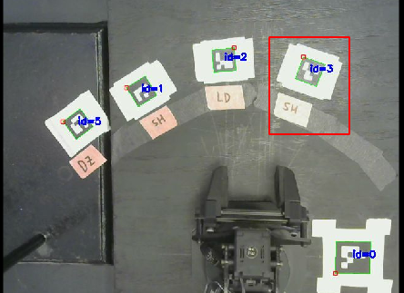

# PNP

This project is called 'PNP' for 'pick and place'. It can simulate a factory
floor, where parts are _picked up_ and _placed down_ during various stages of a
manufacturing process.

---
## Table of Contents
- [Video](#video)
- [What](#what)
---

## Video
[Watch the project in action!](https://drive.google.com/file/d/1KwD7RT69WAX70gCqWBaPEyARUFQieyVz/view?usp=sharing)

## What

PNP can simulate any factory floor that can be described within the constraints
of its JSON config file (`/config/config.json`).

For instance, PNP ships with an example floor that has two tasks: a wash task
taking 3 seconds, and a weld task taking 2 seconds. 

```json   
"tasks": [
    {
        "id": "wash",
        "duration": 3
    },
    {
        "id": "weld",
        "duration": 2
    }
]
```

Tasks are executed in stations. The same task can be executed by more than one
station. For example, we see below that washing happens at both `station_0` and
`station_2`. This means that if a part needs to be washed, but `station_0` is
currently occupied, it can be handled in `station_2`. 

```json
"stations": [
    {
        "id": "station_0",
        "fid_id": 1,
        "task_id": "wash",
        "free": true 
    },
    {
        "id": "station_1",
        "fid_id": 2,
        "task_id": "weld",
        "free": true 
    },
    {
        "id": "station_2",
        "fid_id": 3,
        "task_id": "wash",
        "free": true 
    }
]
```

Thus, the mapping from tasks to stations can be one-to-many. Stations are
represented by fiducial markers. We see above, for instance, that `station_2` is
paired with a fiducial of id 3. The physical fiducial is marked in red below.


<p align="center">
    <kbd>
        
    </kbd>
</p>


## Why

Measure throughput
